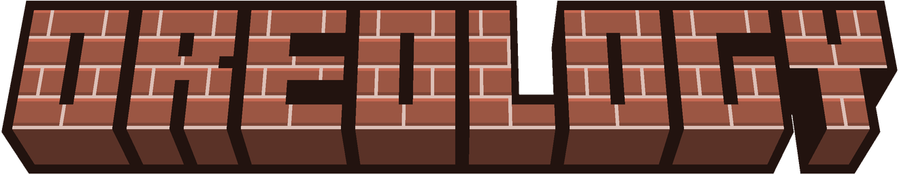

  
    

  
  

___

A basic mod that adds new building blocks and items.

This mod was originally made to have the golden helmet crown texture as its own aesthetic item so my friends and I can use it along with a more reasonable helmet, but it has since evolved into adding custom items that we feel like having and custom blocks for our building projects.

___

## Translations

This mod is available in these languages:

| Language | Locale  |
|----------|---------|
| French   | (fr_fr) |
| German   | (de_de) |
| English  | (en_us) |

## Dependencies

This mods integrates with and/or relies on these mods to work:

| Library | Information |
| ------- | ----------- |
|  | Required Mod Dependency. Made by [TheIllusiveC4](https://github.com/TheIllusiveC4). <https://github.com/TheIllusiveC4/Curios> |

___

## Found an issue?

Please submit it using the [bug tracker](https://github.com/CielSachen/Oreology/issues).
